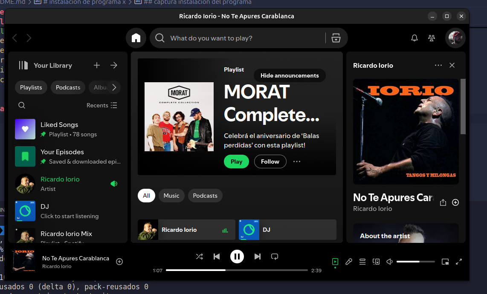

# instalacion de programa x

esta es una guia de instalacion de el programa ...

## programa1

descripciom

## paso1 busqueda del programa

```bash
 ✘ guillenec@localhost  ~/.ssh  sudo apt-cache search obs-studio
[sudo] contraseña para guillenec: 
obs-plugin-looking-glass - Looking Glass KVM FrameRelay plugin for OBS-Studio
obs-studio - recorder and streamer for live video content
 guillenec@localhost  ~/.ssh  

```

## paso 3 instalacion

```bash
 guillenec@localhost  ~/.ssh  sudo apt install obs-Studio
Leyendo lista de paquetes... Hecho
Creando árbol de dependencias... Hecho
Leyendo la información de estado... Hecho
E: No se ha podido localizar el paquete obs-Studio
 ✘ guillenec@localhost  ~/.ssh 
```

## captura instalacion del programa



## añadimos una tabla

| Izquierda  | Centro   | Derecha |
|:---------- |:--------:|--------:|
| Dato 1     | Dato 2   | Dato 3  |
| Dato 4     | Dato 5   | Dato 6  |

## integrantes

|  |  |
|-----------------------|-------------------|
| **Guillermo Neculqueo**  | **Lucero Camila** |
| <guillermoneculqueoq@gmail.com> | <camila_lucero@gmail.com> |
| [](https://github.com/guillenec) [](https://linkedin.com/in/guillenec) | [](https://github.com/camila_lucero) [](https://linkedin.com/in/camila_lucero) |

## Hola 123
